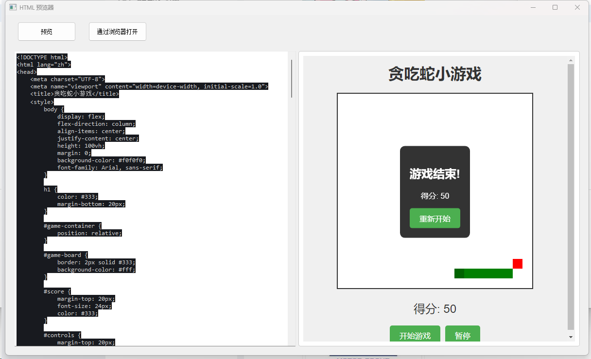

# HTML预览器

一个简单的HTML文件预览工具，使用PyQt5构建。

## 功能特点

- 支持实时预览HTML文件
- 简洁的用户界面
- 支持拖拽文件
- 自动刷新预览

## 下载和安装

1. 前往[Release页面](https://github.com/yourusername/html_overlook/releases)下载最新版本的exe文件
2. 下载完成后双击运行即可，无需安装

## 使用方法

1. 运行程序后，将HTML代码复制粘贴进入窗口后即可预览
2. 修改HTML文代码后，预览会自动更新
3. 点击"预览"按钮可以刷新预览
4. 点击"通过浏览器打开"按钮可以在默认浏览器中查看

## 技术栈

- Python
- PyQt5
- QWebEngineView

## 预览效果

